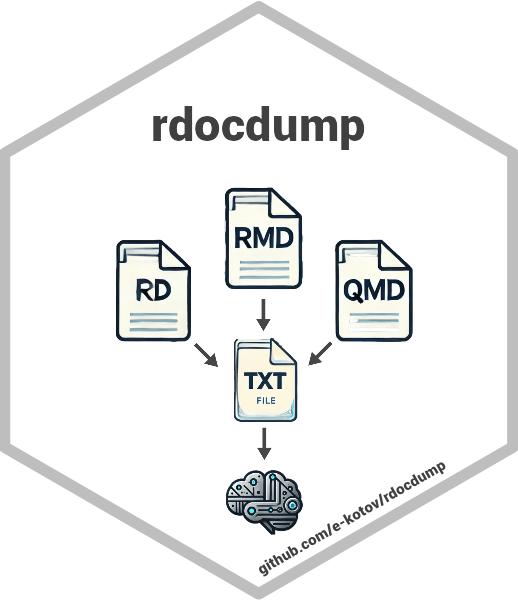

<!-- README.md is generated from README.Rmd. Please edit that file -->

# rdocdump: Dump ‘R’ Package Source, Documentation, and Vignettes into One File <a href="https://www.ekotov.pro/rdocdump/"></a>

<!-- badges: start -->

[](https://www.repostatus.org/#active)
[](https://lifecycle.r-lib.org/articles/stages.html#experimental)
[](https://CRAN.R-project.org/package=rdocdump)
<a href="https://CRAN.R-project.org/package=rdocdump"
target="_blank"></a>
<a href="https://CRAN.R-project.org/package=rdocdump"
target="_blank"></a>
[](https://github.com/e-kotov/rdocdump/actions/workflows/R-CMD-check.yaml)
[](https://github.com/e-kotov/rdocdump/actions?query=workflow%3Apkgcheck)

[](https://doi.org/10.32614/CRAN.package.rdocdump)
[](https://doi.org/10.5281/zenodo.15072446)
<!-- badges: end -->

Dump source code, documentation and vignettes of an `R` package into a
single file. Supports installed packages, `tar.gz` archives, and package
source directories. If the package is not installed, only its source is
automatically downloaded from CRAN for processing. The output is a
single plain text file or a `character` vector, which is useful to
ingest complete package documentation and source into a large language
model (LLM) or pass it further to other tools, such as
<a href="https://github.com/tidyverse/ragnar"
target="_blank"><code>{ragnar}</code></a> to create a
Retrieval-Augmented Generation (RAG) workflow.

## Installation

Install the latest stable release of `rdocdump` from CRAN with:

``` r
install.packages("rdocdump")
```

You can install the development version of `rdocdump` from R Universe
with:

``` r
install.packages('rdocdump',
 repos = c('https://e-kotov.r-universe.dev', 'https://cloud.r-project.org')
)
```

or from GitHub with:

``` r
# install.packages("pak")
pak::pak("e-kotov/rdocdump")
```

## Example

Extract documenation and source code of `{rJavaEnv}` package by
downloading source from CRAN and save it to file `rJavaEnv_docs.txt`

``` r
rdd_to_txt(
  pkg = "rJavaEnv",
  file = tempfile("rJavaEnv_docs_", fileext = ".txt"),
  force_fetch = TRUE, # force download even if package is installed
  keep_files = "none" # delete temp files
)
```

## Citation

To cite package ‘rdocdump’ in publications use:

Kotov E (2025). *rdocdump: Dump R Package Source, Documentation, and
Vignettes into One File*. doi:10.32614/CRAN.package.rdocdump
<https://doi.org/10.32614/CRAN.package.rdocdump>,
<https://github.com/e-kotov/rdocdump>.

BibTeX:

    @Manual{rdocdump,
      title = {rdocdump: Dump R Package Source, Documentation, and Vignettes into One File},
      author = {Egor Kotov},
      year = {2025},
      url = {https://github.com/e-kotov/rdocdump},
      doi = {10.32614/CRAN.package.rdocdump},
    }
